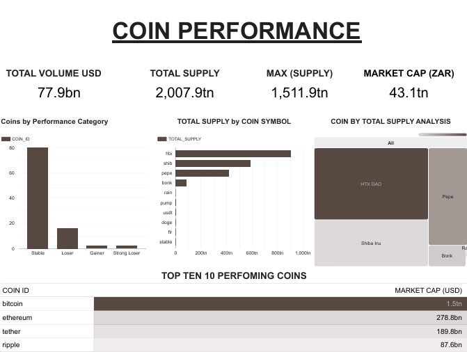
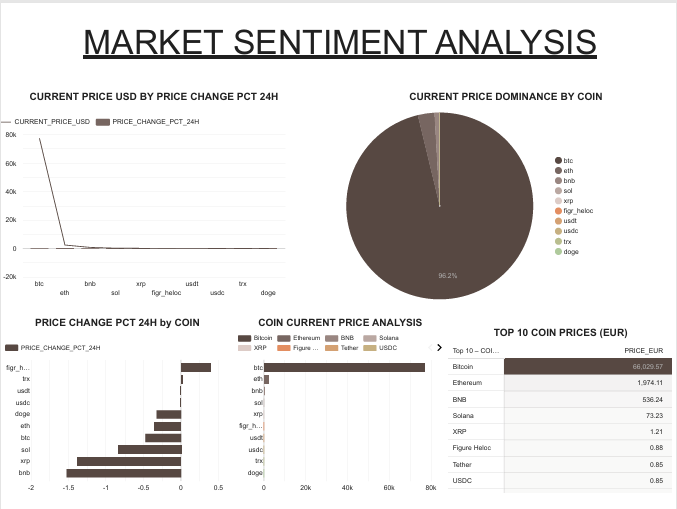
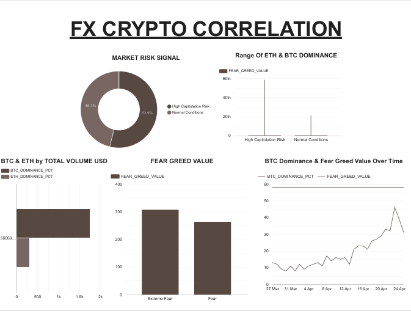

# Crypto Analytics Pipeline

> End-to-end data engineering pipeline for ingesting, transforming, and modelling cryptocurrency and financial market data into analytics-ready datasets.

**Stack:** Snowflake · dbt · Apache Airflow · Docker

---

## Overview

This pipeline processes live data from multiple external APIs and delivers structured mart models purpose-built for BI consumption in Looker Studio. It is designed around append-only ingestion for time-series analysis, incremental transformation, and a clean separation between staging and business logic layers.

**Data volume:** ~500+ cryptocurrencies per run  
**Cadence:** Daily snapshot with historical accumulation  
**External sources:** CoinGecko · Exchange Rates API · Fear & Greed Index

---

## Architecture

### dbt Model Layers

#### Staging — `models/staging/`

One model per source. Responsibilities are strictly limited to:

- Renaming and standardising column names
- Casting types and handling NULLs
- No business logic whatsoever

This keeps upstream changes isolated and the transformation layer clean.

#### Marts — `models/marts/`

Business logic lives exclusively here: cross-currency calculations, aggregations, classification, and signals. These models serve directly as Looker Studio data sources.

| Mart | Description |
|------|-------------|
| `mart_coin_performance` | Top coins by market cap with ZAR/EUR pricing, performance categorisation, and supply metrics |
| `mart_market_sentiment` | Price dominance, momentum signals, EUR pricing, and sentiment classification |
| `mart_fx_crypto_correlation` | BTC/ETH dominance vs Fear & Greed index with market risk signals |

---

## Data Quality

dbt tests are implemented across both layers. Example schema definition:

```yaml
models:
  - name: mart_coin_performance
    columns:
      - name: coin_id
        tests:
          - not_null
          - unique
      - name: current_price_usd
        tests:
          - not_null
      - name: market_cap_usd
        tests:
          - not_null
```

Validation operates in two passes:

1. **Automated dbt tests** run on every pipeline execution as a quality gate before dashboard refresh
2. **Visual validation** against warehouse data to catch semantic issues that tests alone may miss

---

## Orchestration

The pipeline runs daily at **06:00 UTC** via Apache Airflow.

```
[Fetch APIs] → [Load to Snowflake] → [dbt run] → [dbt test] → [Dashboard refresh]
```

Design principles:

- Independent ingestion tasks per API source
- Downstream tasks gate on upstream success
- dbt serves as both the transformation layer and the quality gate
- Retry logic handles transient API failures

---

## Containerisation

The full environment is containerised for reproducibility across machines.

```bash
docker-compose up
```

No local dependency management required — the compose stack bootstraps Airflow, dbt, and all ingestion dependencies.

---

## Performance & Optimisation

- **Incremental models** where applicable to avoid full reprocessing
- **Column pruning** to reduce Snowflake scan costs
- **Domain-separated marts** to keep query surfaces narrow and models independently scalable

---

## Project Structure

```
crypto-analytics-snowflake/
├── dashboard/
│   ├── coin_performamnce.png
│   ├── market_sentiment.png
│   └── correlation.png
├── models/
│   ├── staging/          # One model per source, no business logic
│   └── marts/            # Business logic, cross-currency, aggregations
├── dags/                 # Airflow DAG definitions
├── dbt_project.yml
├── docker-compose.yml
├── Dockerfile
├── ingest.py
├── requirements.txt
└── .gitignore
```

---

## Dashboard

**Live report:** [View in Looker Studio →](https://datastudio.google.com/reporting/ae173d1f-b45f-434d-b969-fb2ba4420231)

---

### Coin Performance

Tracks market cap rankings across 500+ coins with ZAR pricing, performance categorisation (Gainer / Loser / Stable / Strong Loser), total supply distribution, and a top 10 leaderboard by market cap.



---

### Market Sentiment Analysis

Monitors BTC price dominance (96.2% at time of capture), 24h price change momentum per coin, EUR-denominated top 10 pricing, and sentiment classification signals.



---

### FX & Crypto Correlation

Overlays BTC/ETH dominance against the Fear & Greed index to surface macro risk signals. Tracks high capitation risk (46.1%) vs normal conditions (53.9%) and plots dominance vs sentiment over time.



---

## Key Engineering Decisions

**Domain-separated marts, not a mega-mart**  
Each mart serves a specific analytical domain. This avoids the wide-table anti-pattern and keeps models independently evolvable.

**Thin staging layer**  
Staging models do one thing: clean and standardise. Business definitions live in marts, not scattered across transformations.

**Cross-currency pricing (ZAR/EUR)**  
FX rates are refreshed per execution, keeping cross-currency metrics current without stale rate assumptions baked into the model.

**Dual validation strategy**  
Automated dbt tests catch structural issues at runtime. Visual validation against the warehouse catches semantic drift that schema tests cannot.

---

## Future Improvements

- **Streaming ingestion** via Kafka or Snowflake Streaming for sub-daily latency
- **Alerting layer** for volatility thresholds and data freshness SLAs
- **CI/CD for dbt** — automated test runs on pull requests before merging model changes
- **Data lineage** via dbt exposures to document mart-to-dashboard relationships

---

## Author

**Proud Kudzai Ndlovu**  
Data Engineer · Analytics Engineer

- GitHub: [ApostolicDA](https://github.com/ApostolicDA)
- LinkedIn: [proud-ndlovu-89070854](https://www.linkedin.com/in/proud-ndlovu-89070854)

Open to remote roles globally · SAST (UTC+2)
